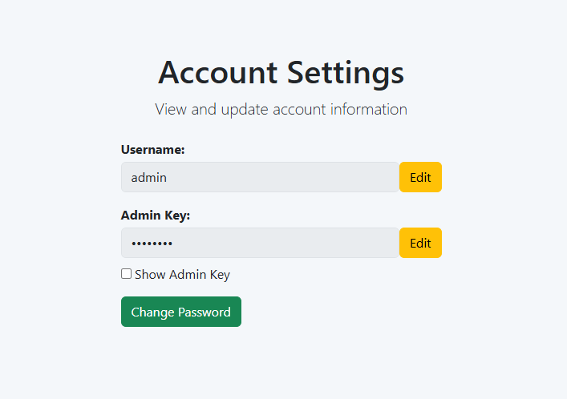
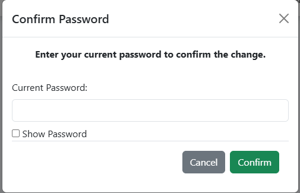
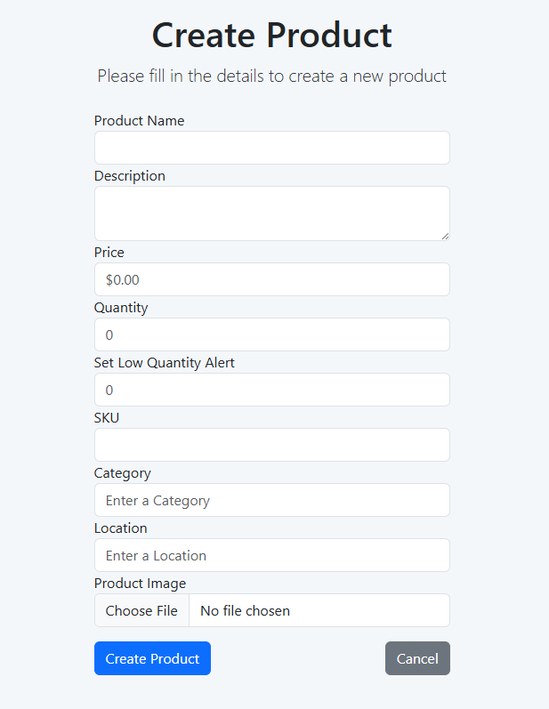
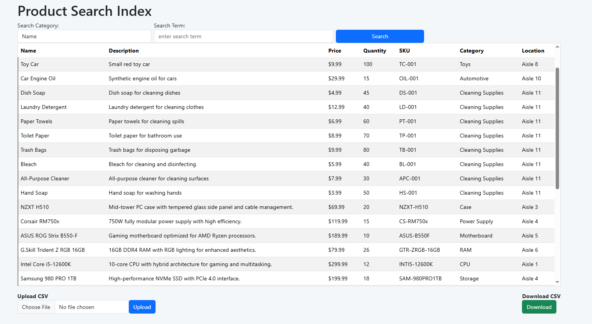
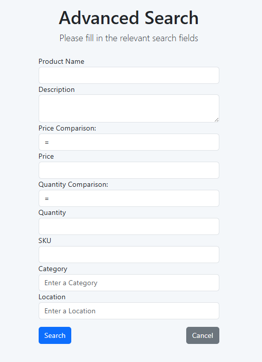
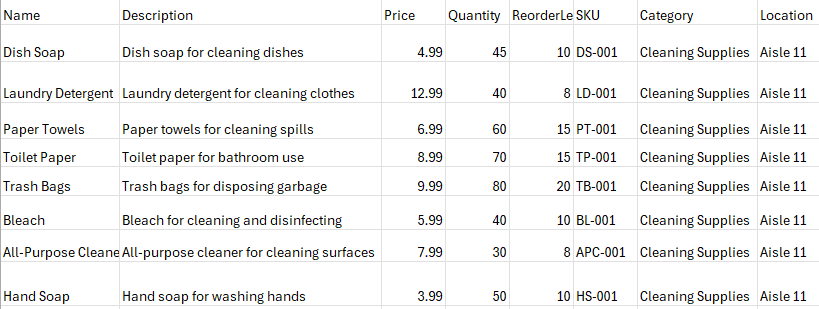

\
% Inventory Management System - User Guide
% CodeBaddies
% May 2025

# Table of Contents
- [Table of Contents](#table-of-contents)
- [1. Prerequisites](#1-prerequisites)
- [2. Installation](#2-installation)
- [3. Uninstallation](#3-uninstallation)
- [4. Quick Start](#4-quick-start)
- [5. Feature Walkthrough](#5-feature-walkthrough)
  - [5.1 Login](#51-login)
  - [5.2 Create Account](#52-create-account)
  - [5.3 Account Settings](#53-account-settings)
  - [5.4 Product Creation](#54-product-creation)
  - [5.5 Product Management](#55-product-management)
    - [5.5.1 Product Searching](#551-product-searching)
    - [5.5.2 Product Popup](#552-product-popup)
    - [5.5.2 CSV Upload \& Download](#552-csv-upload--download)
  - [5.6 Inventory Alerts](#56-inventory-alerts)
  - [5.7 Main Dashboard](#57-main-dashboard)
  - [5.8 Sales Page](#58-sales-page)
- [6. Additional Information](#6-additional-information)
  - [6.1 Password Requirements](#61-password-requirements)
  - [6.2 SKU Requirements](#62-sku-requirements)
- [7. Troubleshooting](#7-troubleshooting)
- [8. Contact](#8-contact)

# 1. Prerequisites
- Docker Desktop installed and running
- .NET 9 SDK
- Git
- VS Code or other editor
- Access credentials (DB password, etc.)

# 2. Installation
```bash
git clone https://github.com/YourTeam/ims.git
cd ims
.\install.ps1  # On Windows PowerShell
# or
./install.sh   # On Linux/macOS
```

# 3. Uninstallation
```bash
.\uninstall.ps1
# or
./uninstall.sh
```

# 4. Quick Start
```bash
docker-compose up
# Access at http://localhost:PORT
```


# 5. Feature Walkthrough
This section walks through the login process for your first visit of the webpage, as well as an overview of the functionality of each webpage. 
## 5.1 Login
<table>
  <tr>
    <td>
    <b>The Login page is used to validate access the inventory system via a verified account.</b></br></br>
    This is the first page displayed wehn accessing the website, it can also be accessed via the "Login" option located on the navigation bar while signed out.<br><br>
    First Login:
      <ol>
        <li>Navigate to the login page.</li>
        <li>Use the provided demo account or a previously registered account.
      <br><b>The demo account's login is:</b>
      <ul>
        <li><b>Username: Admin</b> </li>
        <li><b>Password: Password1!</b> </li>
      </ul>
      </li>
      <li>We recommend you visit the <a href= "#53-account-settings">Account settings</a> page and change this account's information after your first login, as this information is default to all new IMS instances and may present a vulnerability.</li>
        <li>Use this account as a starting point to create more accounts with or without IT permissions.</li>
      </ol>
    </td>
    <td>
      
    </td>
  </tr>
</table>

## 5.2 Create Account

<table>
  <tr>
    <td>
    <b>The Create Account page is used to create new User and I.T. User accounts which are required to access the inventory system.</b><br><br>
    To access this page, press the "Create Account" button located on the Login page or the "Create Account" option located on the navigation bar while signed out.<br><br>
    Account creation:
    <ul>
      <li>To create an account, enter a unique username and a password. Password creation follows the requirements outlined in <a href= "#61-password-requirements">6.1 Password Requirements</a>.</li>
      <li>Created accounts must first be verified by an Administrator for Login capability.</li>
    </ul>
    IT Account Creation:
    <ul>
    <li>To create an I.T. Account, the Admin Key of an existing Administrator is required. It is recommended for the sake of security that Administrators create accounts for new Administrators and provide them the account details rather than distribute their own Admin Key.</li>
      <li>A fresh Admin Key will be generated for each IT account. this key can be changed by visiting the Account Settings page as an IT user.</li></ul>
    </td>
    <td>
      
    </td>
  </tr>
</table>

## 5.3 Account Settings
<table>
  <tr>
    <td>
    <b>The Account Settings page provides functionality to modify existing account information for the currently logged in account.</b><br><br>
    To access this page, press the "Manage Account" option on the navigation bar.<br><br>
    Editing Account Information:
      <ul>
      <li>New usernames must be unique.
      <li>New passwords must meet the requirements outlined in <a href= "#61-password-requirements">6.1 Password Requirements.</a></li>
      <li>Administrators will see an option to edit their admin key. An updated key can be any permutation of 8 or more alphanumeric characters.
      <li>Changes made to the current account information must be confirmed with the user's current password.
      </ul>
    </td>
    <td>
      <div style="display: flex; flex-direction: column; gap: 10px;">
        
        
      </div>
    </td>
  </tr>
</table>

## 5.4 Product Creation
<table>
  <tr>
    <td>
    <b>The Create Product page is used to create new product information which is entered into the inventory database.</b><br><br>
    To access this page, press the "Create New Product" option on the navigation bar.<br><br>
    Creating a Product:
    <ul>
      <li>To create a product, enter the relevant information into the fields.
      <li>The only required field to create a product is name. There is no uniqueness requirement for product names.
      <li> The formatting requirements for a product's SKU are outlined in <a href= "#62-sku-requirements">6.2 SKU Requirements</a>.</li>
    </ul>
    </td>
    <td>
      
    </td>
  </tr>
</table>


## 5.5 Product Management
<table>
  <tr>
    <td>
    <b>The Inventory page provides a range of functionality for viewing, searching, and updating the inventory database.</b><br><br>
    To access this page, press the "Inventory" option on the navigation bar.<br><br>
    Included Features:
      <ul>
        <li>Inventory searching by category
        <li>Advanced Searching by multiple categories
        <li>Product information popups with editing and deletion.</li>
        <li>Direct upload of CSV tables to the inventory
        <li>Downloading the current search result to a CSV file
        </li>
      </ul>
    </td>
    <td>
        
    </td>
  </tr>
</table>

### 5.5.1 Product Searching
<table>
  <tr>
    <td>
<b>Located at the top of the page is a search bar which can search the inventory list for products based off of certain categories.</b><br><br>
Search Categories:
  <ul>
    <li>Name</li>
    <li>Description</li>
    <li>Price</li>
    <li>Quantity</li>
    <li>SKU</li>
    <li>Category</li>
    <li>Location</li>
    <li>Advanced Query
  </ul>
Advanced Query:
  <ul>
    <li>The advanced Query option allows for multiple different catagories to be searched at once.</li>
    <li>Advanced queries can be typed manually or can be build using the query builder, which is accessible by pressing the "Build Query" button when the Advanced Query category is selected.
  </ul>
    <td>
        
    </td>
  </tr>
</table>

### 5.5.2 Product Popup
<table>
  <tr>
    <td>
    <b>Selecting a product from the inventory table will display a popup which lists the full product information. This popup also provides functionality to edit the individual product fields or delete the product from the database.</b><br><br>
Popup Options:
  <ul>
    <li>Pressing the "Edit" button will allow you to update all of the selected product's fields, pressing "Save Changes" will confirm these changes.</li>
    <li>Pressing the "Delete" button will prompt a secondary confirmation popup to delete the item from the database. Pressing "Confirm" will fully remove this item from the database.
  </ul>
    <td>
        
    </td>
  </tr>
</table>

### 5.5.2 CSV Upload & Download
<table>
  <tr>
    <td>
    <b>CSV files can be directly uploaded and Downloaded form the inventory page. Uploaded CSVs will populate their table information directly into the inventory database. Downloaded CSVs are populated with the current search results.</b><br><br>
CSV Upload:
  <ul>
    <li>The Inventory page supports the ability to directly upload CSV table information to the inventory.
    <li>Uploaded CSV's are required to have a header and must be comma-separated.
    <li>The only required field for a CSV is Name, though all included fields must have a header.
    <li>Pressing the "Choose File" button will allow you to choose the file to upload.</li>
    <li>Pressing the "Upload" button will attempt to upload the file contents to the database.
    <li>A error popup will appear if the uploaded file is incorrectly formatted or contains bad data.
</ul>
CSV Download:
<ul>
  <li>The Inventory page supports the ability to directly download the current search result as a comma-separated CSV file.
  <li>Pressing the "Download" buttom wild initiate a download of the current search result as a CSV file.
  <li>Attempting to download an empty search result will instead give you a CSV of the full inventory.
    <td>
    
    </td>
  </tr>
</table>

## 5.6 Inventory Alerts
- Set thresholds via item modal.
- View alerts in the dashboard and calendar.

## 5.7 Main Dashboard
<table>
  <tr>
    <td>
      <ul>
        <li>Monitor pie chart, alerts, and scanning activity.</li>
        <li>Use filters to query data.</li>
        <li>To use the Scanner, you must have a Camera on the device you are using.
          <ul>
            <li>It will auto-detect your Camera and ask for permission to use it.</li>
            <li>Scan Items based off of their SKU inside of the database by creating a barcode.</li>
            <li>Currently there is no integrated barcode generator.
              <ul>
                <li>The website used to create barcodes for testing purposes is: <a href="https://barcode.tec-it.com/en">Barcode.tec-it</a></li>
                <li>Any type of barcode is valid, use version 'Code-128' for best results.</li>
              </ul>
            </li>
            <li>Once finished scanning items, click the 'Complete Transaction' button.
              <ul>
                <li>This will remove the items scanned from the database, based off their quantity.</li>
                <li>It will also add a receipt to the Sales Page.</li>
              </ul>
            </li>
          </ul>
        </li>
      </ul>
    </td>
    <td>
      
    </td>
  </tr>
</table>

## 5.8 Sales Page
<table>
  <tr>
    <td>
      <ul>
        <li>The Sales page, found by clicking on Sales on the navigation bar, is basic.</li>
        <li>It is a page dedicated to housing Receipts made by the Scanner on the Dashboard page.</li>
        <li>It displays:
          <ul>
            <li>Product</li>
            <li>Quantity</li>
            <li>SKU</li>
            <li>Price of each item</li>
            <li>The total of each item</li>
            <li>The total of the entire purchase</li>
            <li>Transaction ID</li>
            <li>Date/Time</li>
          </ul>
        </li>
      </ul>
    </td>
    <td>
      
    </td>
  </tr>
</table>

# 6. Additional Information
Notable information referenced by one or more pages.
## 6.1 Password Requirements
<table>
    <td>
      The creation and modification of any account passwords must comply with the following enforced requirements.<br><br>
      <b>Password Requirements:</b>
      <ul>
        <li>At least one uppercase letter</li>
        <li>At least one lowercase letter</li>
        <li>At least one special character</li>
        <li>At least one digit</li>
        <li>No whitespace characters</li>
        <li>At least 8 Characters</li>
      </ul>
  </tr>
</table>

## 6.2 SKU Requirements
<table>
    <td>
      The creation and modification of product SKUs must follow the following enforced format requirements.<br><br>
      <b>SKU Formatting:</b>
      <ul>
        <li>SKUs are defined by multiple 'categories' separated by dashes.<br> e.g: AAAA-BBBB </li>
        <li>A category must only contain capital letters and digits</li>
        <li>The initial category of an SKU must be 1-5 characters long</li>
        <li>Any following categories are 'subcategories', and can be 1-5 characters long</li>
        <li>An SKU can have at most 4 categories,<br> i.e: a single main category and three following subcategories.</li>
      </ul>
  </tr>
</table>

# 7. Troubleshooting
- **Docker not running**: Make sure Docker Desktop is started.
- **Login issues**: Reset password from login screen.

# 8. Contact
- Maintained by: CodeBaddies
- Email: support@ims.example.com
