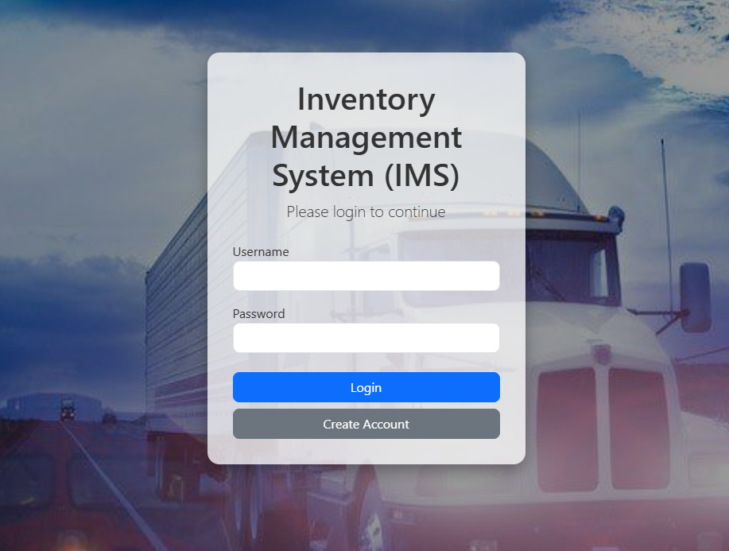
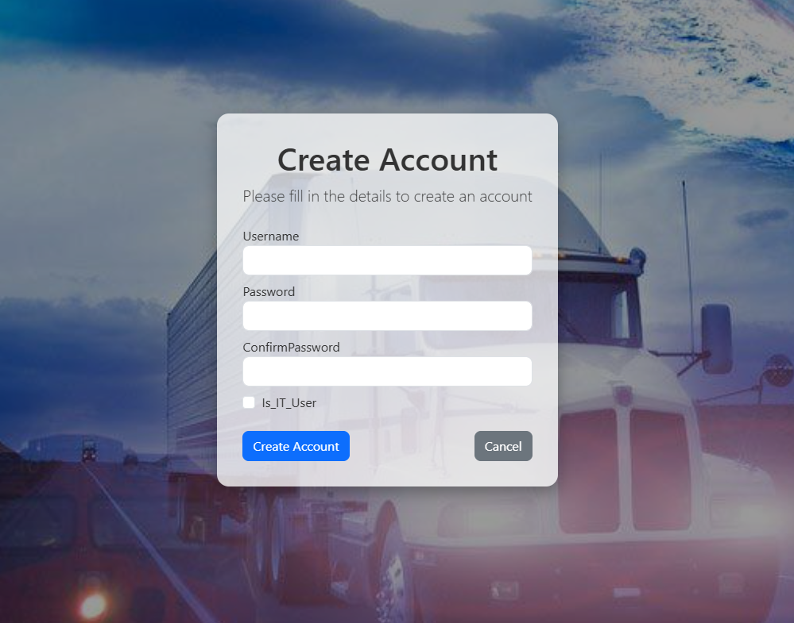
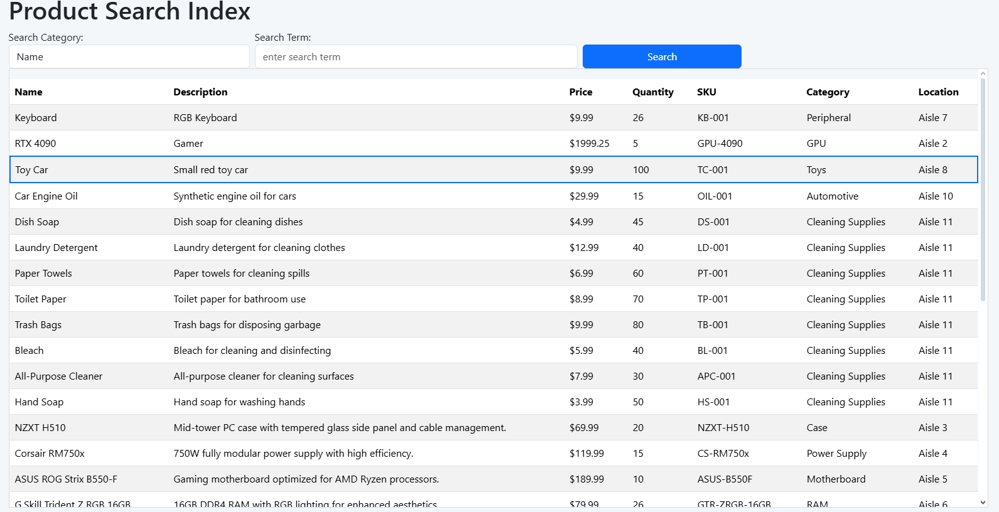
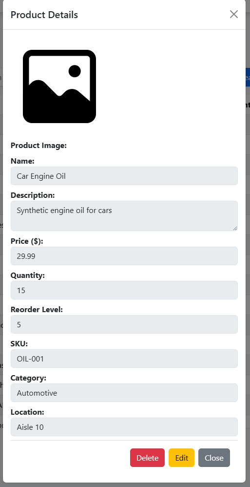
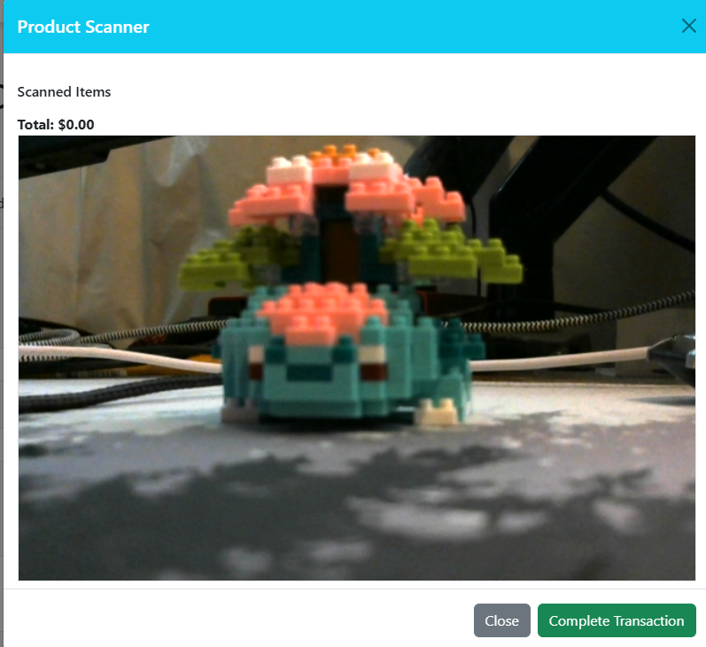
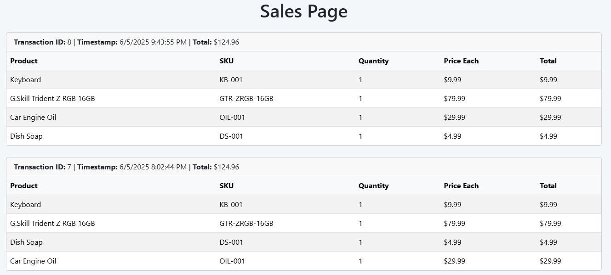

\
% Inventory Management System - User Guide
% CodeBaddies
% May 2025

# Table of Contents
- [Table of Contents](#table-of-contents)
- [1. Prerequisites](#1-prerequisites)
- [2. Installation](#2-installation)
- [3. Uninstallation](#3-uninstallation)
- [4. Quick Start](#4-quick-start)
- [5. Feature Walkthrough](#5-feature-walkthrough)
  - [5.1 Login](#51-login)
  - [5.2 Create Account](#52-create-account)
  - [5.3 Product Management](#53-product-management)
  - [5.4 Inventory Alerts](#54-inventory-alerts)
  - [5.5 Export/Import](#55-exportimport)
  - [5.6 Dashboard Usage](#56-dashboard-usage)
  - [5.7 Sales Page](#57-sales-page)
- [6. Troubleshooting](#6-troubleshooting)
- [7. Contact](#7-contact)

# 1. Prerequisites
- Docker Desktop installed and running
- .NET 9 SDK
- Git
- VS Code or other editor
- Access credentials (DB password, etc.)

# 2. Installation
```bash
git clone https://github.com/YourTeam/ims.git
cd ims
.\install.ps1  # On Windows PowerShell
# or
./install.sh   # On Linux/macOS
```

# 3. Uninstallation
```bash
.\uninstall.ps1
# or
./uninstall.sh
```

# 4. Quick Start
```bash
docker-compose up
# Access at http://localhost:PORT
```

# 5. Feature Walkthrough

## 5.1 Login
<table>
  <tr>
    <td>
      <ol>
        <li>Navigate to the login page.</li>
        <li>Use a demo account or register.</li>
      </ol>
      <b>The Demo account's login is:</b>
      <ul>
        <li><b>Username:</b> </li>
        <li><b>Password:</b> </li>
      </ul>
      <ol start="3">
        <li>Use this account as a starting point to create more accounts with or without IT permissions.</li>
      </ol>
    </td>
    <td>
      
    </td>
  </tr>
</table>

## 5.2 Create Account
<table>
  <tr>
    <td>
      If you are to create an account, your username has no restrictions, however your password does.<br>
      <b>Password Requirements:</b>
      <ul>
        <li>One Uppercase</li>
        <li>One lowercase</li>
        <li>One Special Character</li>
        <li>One Digit</li>
        <li>No Whitespace</li>
        <li>At least 8 Characters</li>
        <li>If you are an IT user, you must get a IT key from a current IT user. </li>
        <li>IT users get admin privelages, and are how accounts are verified.</li>
      </ul>
    </td>
    <td>
      
    </td>
  </tr>
</table>

## 5.3 Product Management
<table>
  <tr>
    <td>
      <ul>
        <li>Add/edit/delete products via the Products page.</li>
        <li>Navigate to the 'Inventory' page using the index at the top of the webpage.</li>
        <li>This page allows you to view each product currently in the database using the embedded list.</li>
        <li>By clicking on a specific product, you are able to see all of the information of the product in a popout window.</li>
        <li>At the bottom of the popout window, you are able to use two buttons, edit or delete.
          <ul>
            <li>Editing allows you to change any information about the product</li>
            <li>Deleting the product will create another popout window, asking you to confirm deletion.</li>
          </ul>
        </li>
        <li>Real-time quantity updates after scans.</li>
        <li>At the top of the page, you are able to search for products based off of certain categories:
          <ul>
            <li>Name</li>
            <li>In Description</li>
            <li>Price</li>
            <li>Quantity</li>
            <li>Sku</li>
            <li>Category</li>
            <li>Location</li>
          </ul>
        </li>
        <li>There is one more search category, Advanced Search: <b>JARED</b></li>
      </ul>
    </td>
    <td>
      <div style="display: flex; flex-direction: row; gap: 10px;">
        
        
      </div>
    </td>
  </tr>
</table>

## 5.4 Inventory Alerts
- Set thresholds via item modal.
- View alerts in the dashboard and calendar.

## 5.5 Export/Import
- Go to Export page.
- Choose chart type or full data.
- Click download to export as CSV or PNG.

## 5.6 Dashboard Usage
<table>
  <tr>
    <td>
      <ul>
        <li>Monitor pie chart, alerts, and scanning activity.</li>
        <li>Use filters to query data.</li>
        <li>To use the Scanner, you must have a Camera on the device you are using.
          <ul>
            <li>It will auto-detect your Camera and ask for permission to use it.</li>
            <li>Scan Items based off of their SKU inside of the database by creating a barcode.</li>
            <li>Currently there is no integrated barcode generator.
              <ul>
                <li>The website used to create barcodes for testing purposes is: <a href="https://barcode.tec-it.com/en">Barcode.tec-it</a></li>
                <li>Any type of barcode is valid, use version 'Code-128' for best results.</li>
              </ul>
            </li>
            <li>Once finished scanning items, click the 'Complete Transaction' button.
              <ul>
                <li>This will remove the items scanned from the database, based off their quantity.</li>
                <li>It will also add a receipt to the Sales Page.</li>
              </ul>
            </li>
          </ul>
        </li>
      </ul>
    </td>
    <td>
      
    </td>
  </tr>
</table>

## 5.7 Sales Page
<table>
  <tr>
    <td>
      <ul>
        <li>The Sales page, found by clicking on Sales on the navigation bar, is basic.</li>
        <li>It is a page dedicated to housing Receipts made by the Scanner on the Dashboard page.</li>
        <li>It displays:
          <ul>
            <li>Product</li>
            <li>Quantity</li>
            <li>SKU</li>
            <li>Price of each item</li>
            <li>The total of each item</li>
            <li>The total of the entire purchase</li>
            <li>Transaction ID</li>
            <li>Date/Time</li>
          </ul>
        </li>
      </ul>
    </td>
    <td>
      
    </td>
  </tr>
</table>

# 6. Troubleshooting
- **Docker not running**: Make sure Docker Desktop is started.
- **Login issues**: Reset password from login screen.

# 7. Contact
- Maintained by: CodeBaddies
- Email: support@ims.example.com
